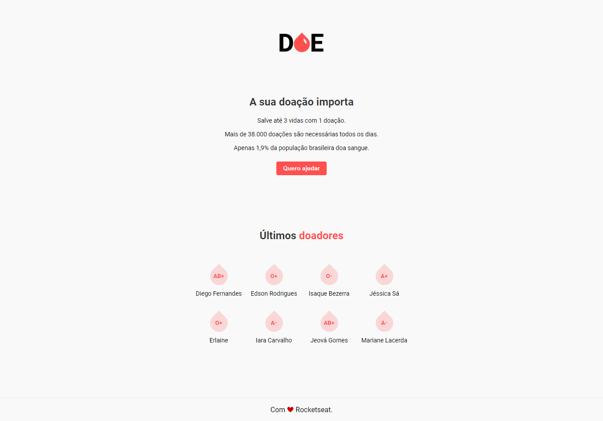
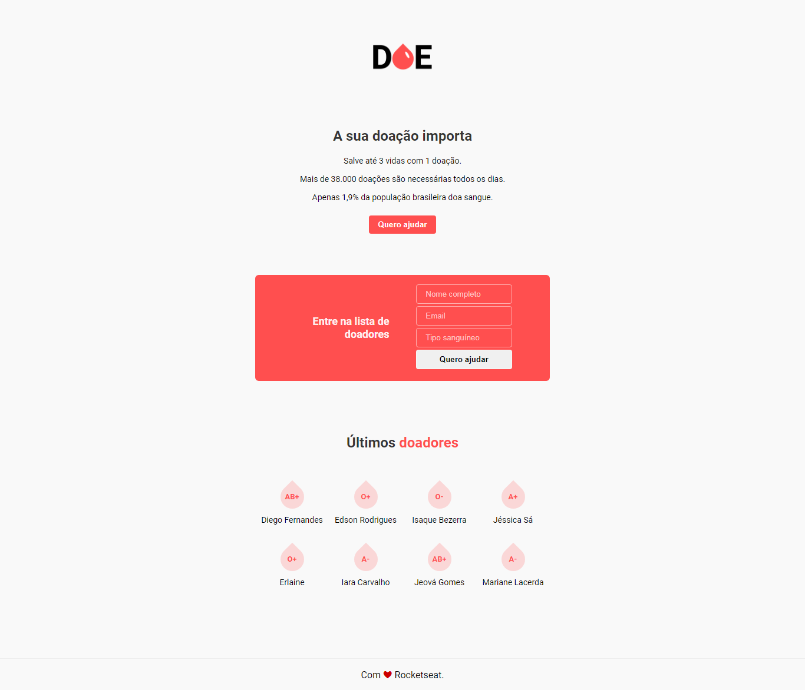

<p align="center">
</img>
</p>

<h1 align="center">MaratonaDev 3.0 - DOE Sangue</h1>

<p align="center">
<a aria-label="Versão do Node" href="https://github.com/nodejs/node/blob/master/doc/changelogs/CHANGELOG_V12.md#12.14.1">
</img>
</a>
<a aria-label="Completo" href="https://rocketseat.com.br/maratonadev/aulas/3.0?aula=2">
</img>
</a>
</p>

### Projeto DOE Sangue Desenvolvido durante a 3ª Edição da MaratonaDev da Rocketseat.

## :rocket: Tecnologias

[Node.js](https://nodejs.org/en/)
| [Javascript](https://developer.mozilla.org/pt-BR/docs/Aprender/JavaScript)
| [Html](https://tableless.com.br/o-que-html-basico/)
| [CSS](https://www.w3schools.com/css/)
| [Nodemon](https://nodemon.io/)
| [PostgreSQL](https://www.postgresql.org/)
| [Nunjucks](https://mozilla.github.io/nunjucks/)

## 💻 Projeto

O sistema Doe Sangue é um cadastro doadores de sangue, feito com Node.js, PostgreSQL e algumas dependências JS. O mesmo foi desenvolvido nos dias 17 e 18 de Fevereiro de 2020, durante a 3ª Edição do MaratonaDev, da Rocketseat.

## Frontend

Página com o form oculto
</img>

Página com o form exposto, ao ser clicado o botão "Quero ajudar"
</img>

## Instalação

1. Em primeiro lugar, é necessário que você tenha o **Node.js** (com o **NPM**) e o **PostgreSQL** instalados em sua máquina. Caso ainda não os tenha, deixarei aqui os links para download, mas infelizmente não poderei na instalação dos mesmos. Segue os respectivos links de download:

- <a href="https://nodejs.org/en/download/">Node.JS</a>
- <a href="https://www.postgresql.org/download/">PostgreSQL</a>

2. Siga às etapas seguintes para realizar a instalação **do projeto em si**:

- Para baixar o projeto em sua máquina:
```
git clone https://github.com/WellersonPrenholato/MaratonaDev-3.0
```

- Entre na pasta do projeto:
```
cd MaratonaDev-3.0
```
- Baixe as depêndencias que o projeto precisa para executar:
```
npm install
```

- No PostgreSQL, crie um Banco de Dados chamado **'doe'** (sem as aspas) e dentro dele uma tabelas chamada **'donors'** (também sem aspas). Segue o código SQL para a criação da tabela:

```
CREATE TABLE "public"."donors" (
"id" int4 DEFAULT nextval('donors_id_seq'::regclass) NOT NULL,
"name" text COLLATE "default" NOT NULL,
"email" text COLLATE "default" NOT NULL,
"blood" text COLLATE "default" NOT NULL
)
WITH (OIDS=FALSE);
```

- Execute o projeto:
```
npm start
```
- Abra o projeto em seu navegador, no seguinte endereço:
```
localhost:3000
```

Então, é isso, galera! Até a próxima! @Rocketseat =)

## :memo: Licença

#### Projeto sob licença [MIT](./LICENSE) &copy; [Rocketseat](https://rocketseat.com.br/)
